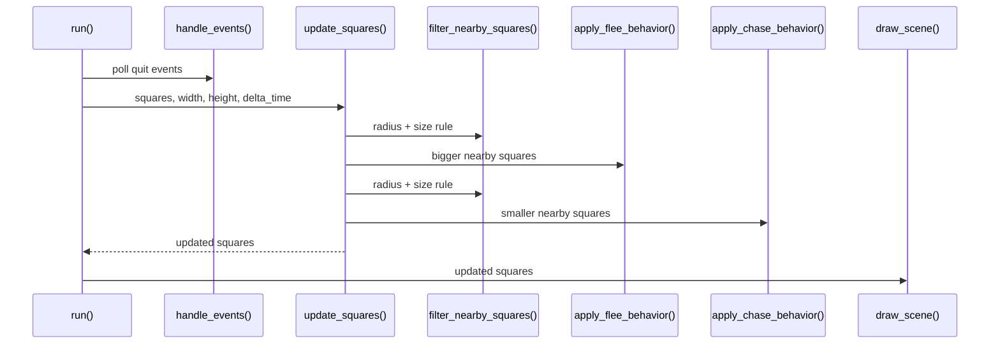

# Runtime Behavior

## 1. Per-Frame Sequence

Each frame follows the same pattern:

1. Poll pygame events and stop if the user quits.
2. Measure elapsed time with `clock.tick(FPS)`.
3. Update every square.
4. Clear and redraw the scene.
5. Present the new frame with `pygame.display.flip()`.

The elapsed time is converted into seconds and passed into the simulation as `delta_time`.

## 2. Update Pipeline Per Square

`update_squares` processes each square in four phases:

1. **Age and respawn**
    - Add `delta_time` to `square.age`.
    - If the square has reached its lifespan, replace it with `create_random_square()`.

2. **Neighbor detection and steering**
    - Call `find_bigger_nearby_squares()` with `FLEE_RADIUS`.
    - Call `apply_flee_behavior()` with `FLEE_STRENGTH * delta_time`.
    - Call `find_smaller_nearby_squares()` with `CHASE_RADIUS`.
    - Call `apply_chase_behavior()` with `CHASE_STRENGTH * delta_time`.

3. **Motion integration**
    - Update position using current velocity and `delta_time`.
    - This keeps movement stable even if frame rate changes.

4. **Boundary handling**
    - Clamp positions against the screen edges.
    - Reverse velocity when a square hits a wall.

## 3. Data Flow

## 4. Behavioral Notes

- Flee and chase both add steering to the current velocity instead of replacing it.
- `clamp_speed` keeps the result within each square's speed limit.
- The direction vectors are normalized before scaling so the chosen strength behaves consistently.
- Neighbor checks are limited by radius, which keeps distant squares from influencing each other.

## 5. Complexity

Neighbor lookup is still pairwise across the list of squares.

- Time complexity is approximately $O(n^2)$ for `n` squares.
- The current `SQUARE_COUNT` is small, so this is fine for the project.
- If the population grows, a spatial index such as a uniform grid or quadtree would be the next step.
